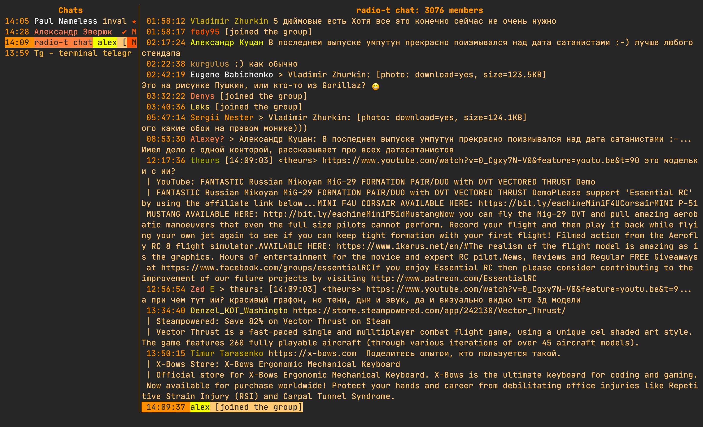

# tg

[](https://t.me/tg_term)

Telegram terminal client.




## Features

- [X] view mediafiles: photo, video, voice/video notes, documents
- [X] ability to send pictures, documents, audio, video
- [X] reply, edit, forward, delete, send messages
- [X] stickers
- [X] notifications
- [X] record and send voice msgs
- [X] auto download files
- [X] toggle chats: pin/unpin, mark as read/unread, mute/unmute
- [X] message history
- [X] list contacts
- [X] show user status
- [X] secret chats
- [ ] search
- [ ] bots (bot keyboard)


## Requirements

To use tg, you'll need to have the following installed:

- [Python >= 3.8](https://www.python.org/downloads/)


## Optional dependencies

- [terminal-notifier](https://github.com/julienXX/terminal-notifier) - for Mac (used by default). You can change it to [dunst](https://github.com/dunst-project/dunst) for Linux or any other notifications program (see `NOTIFY_CMD` in configuration)
- [ffmpeg](https://ffmpeg.org/) - to record voice msgs and upload videos.
- [tdlib](https://tdlib.github.io/td/build.html?language=Python) - in case of incompatibility with built in package.
  For example, macOS:
  ```sh
  brew install tdlib
  ```
  and then set in config `TDLIB_PATH`
- `urlview` to choose urls when there is multiple in message, use `URL_VIEW` in config file to use another app (it should accept urls in stdin)
- to open `stickers` and `animated` ones (thumbnail preview) you need to set in mailcap appropriate handler and have app which will open `webp` file:
  ```ini
  image/webp; mpv %s
  ```
- [ranger](https://github.com/ranger/ranger), [nnn](https://github.com/jarun/nnn) - can be used to choose file when sending, customizable with `FILE_PICKER_CMD`
- [fzf](https://github.com/junegunn/fzf) - to create groups and secret chats (used for single and multiple user selection)

## Installation

### From PyPI

This option is recommended for production:

```sh
pip3 install tg
tg
```

### Homebrew

```sh
brew tap paul-nameless/homebrew-repo
brew install tg
```

### From sources

This option is recommended for development:

```sh
git clone https://github.com/paul-nameless/tg.git
cd tg
pip install python-telegram
pip install .
tg
```

### Using Docker

> Note that voice recordings and notifications won't work when using Docker.

```sh
docker run -it --rm ghcr.io/paul-nameless/tg
```

### From the AUR

If you're using Arch Linux, you can install tg through [its AUR package](https://aur.archlinux.org/packages/telegram-tg/):

If you're using the `yay` AUR helper, you can install the package with:
```bash
yay -S telegram-tg
```

If you want to use the latest developement version via the AUR you can find it [here](https://aur.archlinux.org/packages/telegram-tg-git/)

## Configuration

Config file should be stored at `~/.config/tg/conf.py`. This is simple python file.

### Simple config:

```python
# should start with + (plus) and contain country code
PHONE = "[phone number in international format]"
```

### Advanced configuration:

All configurable variables can be found [here](https://github.com/paul-nameless/tg/blob/master/tg/config.py)

```python
import os

# You can write anything you want here, file will be executed at start time
# You can keep you sensitive information in password managers or gpg
# encrypted files for example
def get_pass(key):
    # retrieves key from password store
    return os.popen("pass show {} | head -n 1".format(key)).read().strip()


PHONE = get_pass("i/telegram-phone")
# encrypt you local tdlib database with the key
ENC_KEY = get_pass("i/telegram-enc-key")

# log level for debugging, info by default
LOG_LEVEL = "DEBUG"
# path where logs will be stored (all.log and error.log)
LOG_PATH = os.path.expanduser("~/.local/share/tg/")

# If you have problems with tdlib shipped with the client, you can install and
# use your own, for example:
TDLIB_PATH = "/usr/local/Cellar/tdlib/1.6.0/lib/libtdjson.dylib"

# you can use any other notification cmd, it is simple python string which
# can format title, msg, subtitle and icon_path paramters
# In these exapmle, kitty terminal is used and when notification is pressed
# it will focus on the tab of running tg
NOTIFY_CMD = "/usr/local/bin/terminal-notifier -title {title} -subtitle {subtitle} -message {msg} -appIcon {icon_path} -sound default -execute '/Applications/kitty.app/Contents/MacOS/kitty @ --to unix:/tmp/kitty focus-tab --no-response -m title:tg'"

# You can use your own voice recording cmd but it's better to use default one.
# The voice note must be encoded with the Opus codec, and stored inside an OGG
# container. Voice notes can have only a single audio channel.
VOICE_RECORD_CMD = "ffmpeg -f avfoundation -i ':0' -c:a libopus -b:a 32k {file_path}"

# You can customize chat and msg flags however you want.
# By default words will be used for readability, but you can make
# it as simple as one letter flags like in mutt or add emojies
CHAT_FLAGS = {
    "online": "●",
    "pinned": "P",
    "muted": "M",
    # chat is marked as unread
    "unread": "U",
    # last msg haven't been seen by recipient
    "unseen": "✓",
    "secret": "🔒",
    "seen": "✓✓",  # leave empty if you don't want to see it
}
MSG_FLAGS = {
    "selected": "*",
    "forwarded": "F",
    "new": "N",
    "unseen": "U",
    "edited": "E",
    "pending": "...",
    "failed": "💩",
    "seen": "✓✓",  # leave empty if you don't want to see it
}

# use this app to open url when there are multiple
URL_VIEW = 'urlview'

# Specifies range of colors to use for drawing users with
# different colors
# this one uses base 16 colors which should look good by default
USERS_COLORS = tuple(range(2, 16))

# to use 256 colors, set range appropriately
# though 233 looks better, because last colors are black and gray
# USERS_COLORS = tuple(range(233))

# to make one color for all users
# USERS_COLORS = (4,)

# cleanup cache
# Values: N days, None (never)
KEEP_MEDIA = 7

FILE_PICKER_CMD = "ranger --choosefile={file_path}"
# FILE_PICKER_CMD = "nnn -p {file_path}"

MAILCAP_FILE = os.path.expanduser("~/.config/mailcap")

DOWNLOAD_DIR = os.path.expanduser("~/Downloads/")  # copy file to this dir
```

### Mailcap file

Mailcap file is used for deciding how to open telegram files (docs, pics, voice notes, etc.). Path to the file can be overriden with `MAILCAP_FILE` in config file.

Example: `~/.mailcap`

```ini
# media
video/*; mpv "%s"
audio/ogg; mpv --speed=1.33 "%s"
audio/mpeg; mpv --no-video "%s"
image/*; qview "%s"

# text
text/html; w3m "%s"
text/html; open -a Firefox "%s"
text/plain; less "%s"

# fallback to vim
text/*; vim "%s"
```


## Keybindings

vi like keybindings are used in the project. Can be used commands like `4j` - 4 lines down.

For navigation arrow keys also can be used.

### Chats:

- `j,k`: move up/down
- `J,K`: move 10 chats up/down
- `g`: go to top chat
- `l`: open msgs of the chat
- `m`: mute/unmute current chat
- `p`: pin/unpin current chat
- `u`: mark read/unread
- `r`: read current chat
- `c`: show list of contacts
- `dd`: delete chat or remove history
- `ng`: create new group chat
- `ns`: create new secret chat
- `/`: search in chats
- `?`: show help

## Msgs:

- `j,k`: move up/down
- `J,K`: move 10 msgs up/down
- `G`: move to the last msg (at the bottom)
- `D`: download file
- `l`: if video, pics or audio then open app specified in mailcap file, for example:
  ```ini
  # Images
  image/png; qView "%s"
  audio/*; mpv "%s"
  ```
  if text, open in `less` (to view multiline msgs)
- `e`: edit current msg
- `<space>`: select msg and jump one msg down (use for deletion or forwarding)
- `<ctrl+space>`: same as space but jumps one msg up
- `y`: yank (copy) selected msgs with <space> to internal buffer (for forwarding) and copy current msg text or path to file to clipboard
- `p`: forward (paste) yanked (copied) msgs to current chat
- `dd`: delete msg for everybody (multiple messages will be deleted if selected)
- `i or a`: insert mode, type new message
- `I or A`: open vim to write long msg and send
- `v`: record and send voice message
- `r,R`: reply to a current msg
- `S`: calls a file picker
- `sv`: send video
- `sa`: send audio
- `sp`: send picture
- `sd`: send document
- `o`: open url present in message (if multiple urls, `urlview` will be opened)
- `]`: next chat
- `[`: prev chat
- `u`: show user info (username, bio, phone, etc.)
- `c`: show chat info (e.g. secret chat encryption key, chat id, state, etc.)
- `?`: show help
- `!`: open msg with custom cmd

## Publish

Run script to automatically increase version and release

```sh
./do release
```
